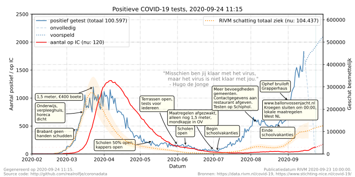
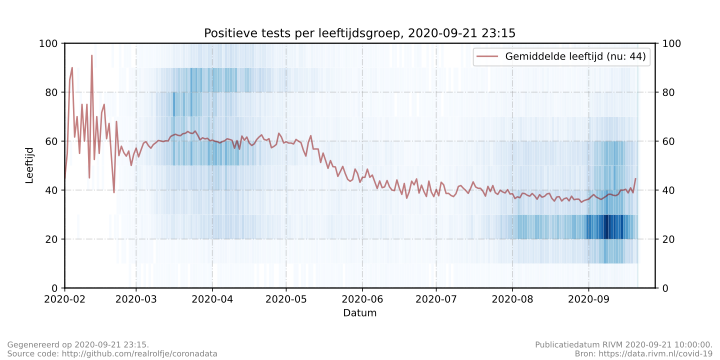

# Coronadata zonder gedoe

Geen smoesjes, je weet het best:
**Houd afstand, werk thuis, was je handen, vermijd drukke plaatsen.**




Data in deze grafieken is afkomstig van het 
[RIVM (Rijksinstituut voor Volksgezondheid en Millieu)](https://www.rivm.nl/) en 
[NICE (Stichting Nationale Intensive Care Evaluatie)](https://www.stichting-nice.nl/index.jsp).
Deze gegevens worden gedownload en lokaal gecached door [brondata.py](scripts/modules/brondata.py).
Het downloaden van nieuwe gegevens, genereren van alle grafieken en bestanden en publiceren van 
deze gegevens in deze repository wordt geregeld door het [update.sh](update.sh) bash script.


## RIVM Covid-19 gegevens

Het grootste deel van de gegevens in deze grafieken zijn afkomstig van het RIVM bestand [Covid-19 karakteristieken per casus, landelijk](https://data.rivm.nl/geonetwork/srv/dut/catalog.search#/metadata/2c4357c8-76e4-4662-9574-1deb8a73f724) dat dagelijks wordt bijgewerkt. De data in dit uitgebreide bestand ziet er als volgt uit (twee voorbeeld
records uit het werkelijke bestand):

```json
[
   {
        "Date_file": "2020-08-01 10:00:00",
        "Date_statistics": "2020-02-20",
        "Date_statistics_type": "DOO",
        "Agegroup": "70-79",
        "Sex": "Female",
        "Province": "Limburg",
        "Hospital_admission": "Yes",
        "Deceased": "Yes",
        "Week_of_death": "202012",
        "Municipal_health_service": "GGD Zuid Limburg"
    },
    {
        "Date_file": "2020-08-01 10:00:00",
        "Date_statistics": "2020-07-31",
        "Date_statistics_type": "DPL",
        "Agegroup": "30-39",
        "Sex": "Female",
        "Province": "Overijssel",
        "Hospital_admission": "No",
        "Deceased": "No",
        "Week_of_death": null,
        "Municipal_health_service": "GGD Regio Twente"
    }
]
```

### Beschrijving van de velden in het RIVM bestand:

| Veld | Beschrijving |
|------|--------------|
| Date_file       | Datum en tijd waarop de gegevens zijn gepubliceerd door het RIVM |
| Date_statistics | Datum voor statistiek; eerste ziektedag, indien niet bekend, datum lab positief, indien niet bekend, melddatum aan GGD (formaat: jjjj-mm-dd) |
| Date_statistics_type | Soort datum die beschikbaar was voor datum voor de variabele "Datum voor statistiek", waarbij:|
| | DOO = Date of disease onset : Eerste ziektedag zoals gemeld door GGD. Let op: het is niet altijd bekend of deze eerste ziektedag ook echt al Covid-19 betrof. |
| |  DPL = Date of first Positive Labresult : Datum van de (eerste) positieve labuitslag. |
| | DON = Date of Notification : Datum waarop de melding bij de GGD is binnengekomen. |
| Agegroup | Leeftijdsgroep. |
| | bij leven: 0-9, 10-19, ..., 90+; |
| | bij overlijden: <50, 50-59, 60-69, 70-79, 80-89, 90+ |
| | Unknown = Onbekend |
| Sex | Geslacht: Unknown = Onbekend, Male = Man, Female = Vrouw |
| Province | Naam van de provincie (op basis van de verblijfplaats van de patiënt) |
| Hospital_admission | Ziekenhuisopname. Unknown = Onbekend, Yes = Ja, No = Nee |
| | Vanaf 1 mei 2020 wordt uitgevraagd of de indicatie van de ziekenhuisopname Covid-19 gerelateerd was. Indien dit niet het geval was is de waarde van deze kolom "No". |
| Deceased | Overlijden. Unknown = Onbekend, Yes = Ja, No = Nee |
| Week of Death | Week van overlijden. YYYYMM volgens ISO-week notatie (start op maandag t/m zondag) |
| Municipal_health_service |  GGD die de melding heeft gedaan. |


## Stichting NICE Intensive care gegevens

Van de Stichting NICE worden de volgende bestanden gebruikt:
- [intake-cumulative](https://www.stichting-nice.nl/covid-19/public/intake-cumulative/), het aantal mensen dat ooit met COVID-19 gerelateerde klachten opgenomen is geweest (cumulatief).
- [intake-count](https://www.stichting-nice.nl/covid-19/public/intake-count/), het aantal mensen dat met COVID-19 gerelateerde klachten aanwezig is op de IC.

Deze bestanden zijn iets eenvoudiger van structuur en zien er als volgt uit:

```json
[
 ...
 {"date":"2020-08-07","value":36},
 {"date":"2020-08-08","value":37},
 {"date":"2020-08-09","value":42},
 ...
]
```

Hierbij is het veld `date` de datum waarop de telling is gedaan, en `value` de waarde van de telling (cumulatieve opnames of aantal patienten op de IC, respectievelijk).
