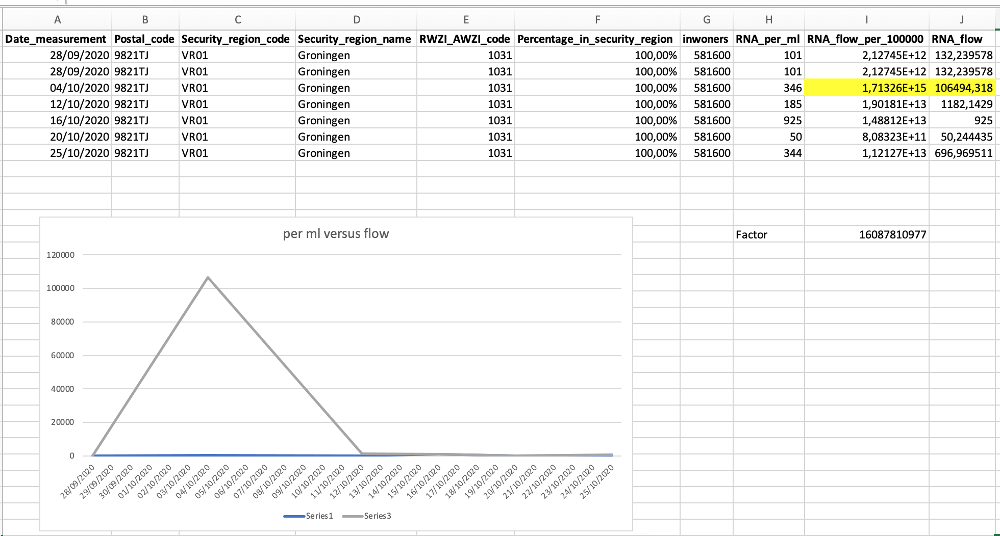
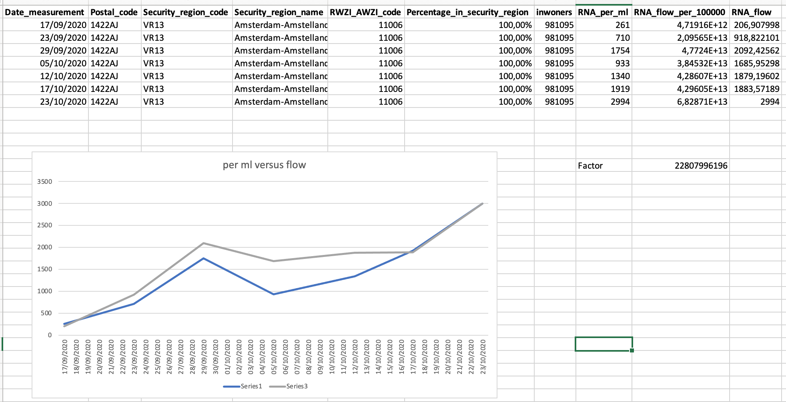

# Het riooldata probleem

## De verdwenen data
In tegenstelling tot wat [RIVM in zijn twitterfeed beweert](https://twitter.com/rivm/status/1324659016480497664), heeft het RIVM tot ver in Oktober meetgegevens geleverd in de grootheid "RNA per ml rioolwater". Deze gegevens werden in combinatie met veiligheidsregiogegevens gebruikt om voorspellingen te doen over het aantal besmettelijke mensen.

Recentelijk is overgeschakeld naar een flowmeting die de grootheid "RNA per 100.000 inwoners" oplevert. Bij het overschakelen heeft het RIVM gemeend om de "RNA per ml" gegevens vanaf 7 september te moeten weggooien. Doordat de onderlinge relatie tussen deze twee gegevens niet heel duidelijk is gaan mijn grafieken en voorspellingen de mist in. Helaas kon ik dit probleem niet aan RIVM duidelijk maken.

## Lang leve backups
Uit een timemachine backup van de server heb ik een oud rioolwaterdatabestand van 1 november gehaald waarin de "RNA per ml" gegevens nog aanwezig waren. Om snel weer de schattingen aan de praat te krijgen heb ik alle "RNA per ml" data en de "RNA per 100.000 inwoners" op elkaar gedeeld en die factor gebruikt om de "RNA per 100.000 inwoners" om te rekenen naar "RNA per ml" zodat de rest van de code het weer deed.

## Het probleem (puzzel mee!)
Ik keek even beter naar de data en het was al snel duidelijk dat er geen lineair verband zit tussen "RNA per ml" en "RNA per 100.000 inwoners". Toch wil ik deze data omrekenen, zodat ik een RNA grafiek kan blijven maken van het begin tot nu, en ook mijn schattingen daarop kan baseren.

De "RNA per ml" leek me logisch: Stel in een regio zijn 2 mensen ziek. De zieke persoon produceert 100 RNA en de betere persoon 0. Dan vinden we dus 50% RNA in het rioolwater. Dit is dan onafhankelijk van hoeveel liter water geproduceerd wordt, als beide personen maar ongeveer hetzelfde rioolwater produceren:

```
ziek  --> 100 -,
                >-- 50% RNA in rioolwater
beter -->   0 -'
``` 

Bij de oude meting is dit ongeveer hoe de meting werkt, omdat "RNA per ml" puur de verhouding RNA per ml water meet, onafhankelijk van het aantal personen of het aantal liters rioolwater. Hoe meer mensen ziek, hoe hoger het getal. Vermenigvuldig dit getal met een vaste factor X en het aantal inwoners in de regio en dan heb je een idee hoeveel mensen in die regio ziek zijn:

```
(RNA * X) * inwoners = aantal zieke inwoners
```

Bij de nieuwe meting is me niet helemaal duidelijk waarom er "per 100.000 inwoners" wordt gemeten en hoe dit werkt. Als er een flowmeter in het riool zit, dan "ziet" die flowmeter alle RNA dat langskomt, maar ook al het niet besmette water, en zou dus m.i. ook een "verhouding" moeten meten, net als hierboven.

Toch kan ik geen lineair verband ontdekken tussen de "RNA per ml" en de "RNA per 100.000" inwoners, zelfs als ik het aantal inwoners in de regio meereken.

In deze directory vind je:

| Bestand | Omschrijving |
|-|-|
| [COVID-19_rioolwaterdata-1-nov-2020.json](https://raw.githubusercontent.com/realrolfje/coronadata/master/temp/riooldataprobleem/COVID-19_rioolwaterdata-1-nov-2020.json) | De "verdwenen" RNA per ml data voor Sept en Okt                 |
| [COVID-19_rioolwaterdata.json](https://raw.githubusercontent.com/realrolfje/coronadata/master/temp/riooldataprobleem/COVID-19_rioolwaterdata.json)                       | De rioolwaterdata zoals hij nu wordt aangeleverd                |
| [combinedata.py](https://raw.githubusercontent.com/realrolfje/coronadata/master/temp/riooldataprobleem/combinedata.py)                                                   | Een script om de data te combineren, met veiligheidsregiodata   |
| [riooldata.xlsx](https://raw.githubusercontent.com/realrolfje/coronadata/master/temp/riooldataprobleem/riooldata.xlsx)                                                   | De output van het script op 14 nov, mocht je geen python hebben |

Waar ik naar op zoek ben is het antwoord op de vraag:
 **Hoe reken ik "RNA per 100.000 inwoners" om naar "RNA per ml" zodat ik een doorlopende grafiek kan maken.**


## HET ANTWOORD (deels)

Mijn gedachte dat er een constante factor moest zijn, blijkt correct. De reden dat ik die niet kon vinden is dat de metingen grote onnauwkeurigheid hebben, en ik bij de steekproeven blijkbaar "ongelukkig koos" waardoor de cosntante factor altijd anders leek.

De Excel sheet is bijgewerkt met drie tabbladen met grafiekjes waarin dit fenomeen mooi zichtbaar is. Allereerst een grafiekje dat strookt met mijn vermoeden:



Hier is de factor tussen de twee meetmethoden een vrij constante **22.807.996.196** (waarom de RWZI getallen met deze gigantische resolutie gebruikt terwijl de metingen zeer onnauwkeurig zijn is me een raadsel overigens).

Echter, in de regio Amstelland zit een uitschieter waardoor die constante factor niet overal lijkt te passen:



Op 4 Oktober heeft de nieuwe meetmethode een meting gedaan die drie ordegroottes (een factor 1000) hoger uitkomt dan de rest. Er zitten meer van dit soort meetfouten in de verschillende regio's, waardoor een constante factor moeilijk vindbaar is. Als we de "foute meting" verwijderen uit deze dataset, dan vinden we voor de regio amstelland een factor van **16.087.810.977**, deze is 75% lager dan de factor in Groningen.

De volgende stap in deze "queste" is het vinden van alle factoren voor alle regio's en zien of daar grote afwijkingen in zitten. Dat zou niet zo mogen zijn, maar zo te zien zijn deze metingen vrij "grillig". Daarnaast is het opvallend dat de RWZI aanduidingen typfouten lijken te bevatten waardoor data "gemixt" zou kunnen zijn.